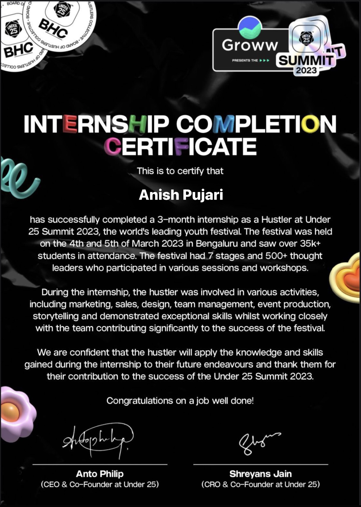

# My Work For all The Certification I have Done

## Under25

  width="200" height="200" 
 
You achieve this certificate after completing 3 months of internship at Under'25 Summit

## Deep Learning with PyTorch: Zero to GANs

You can check the Jupyter Notebook of all the assignments and Project in [this folder](./Deep_Learning) or visit my [Jovian.ai profile](https://jovian.ai/anurag3301)
