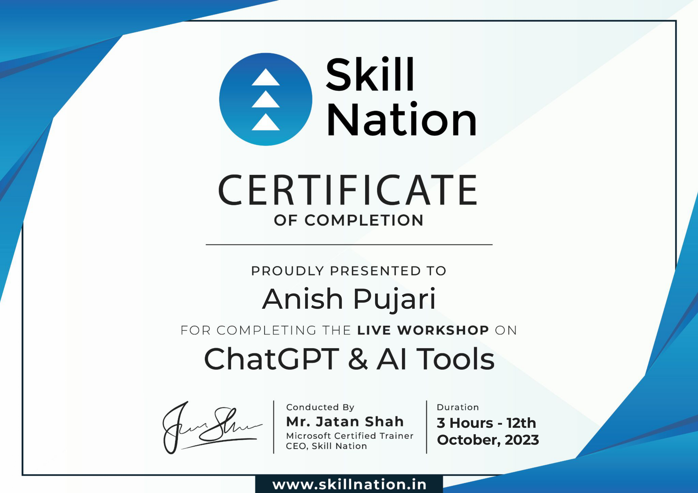
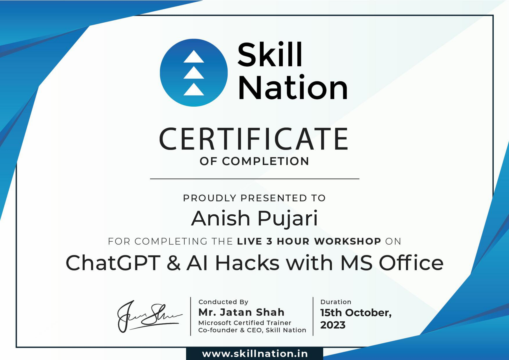
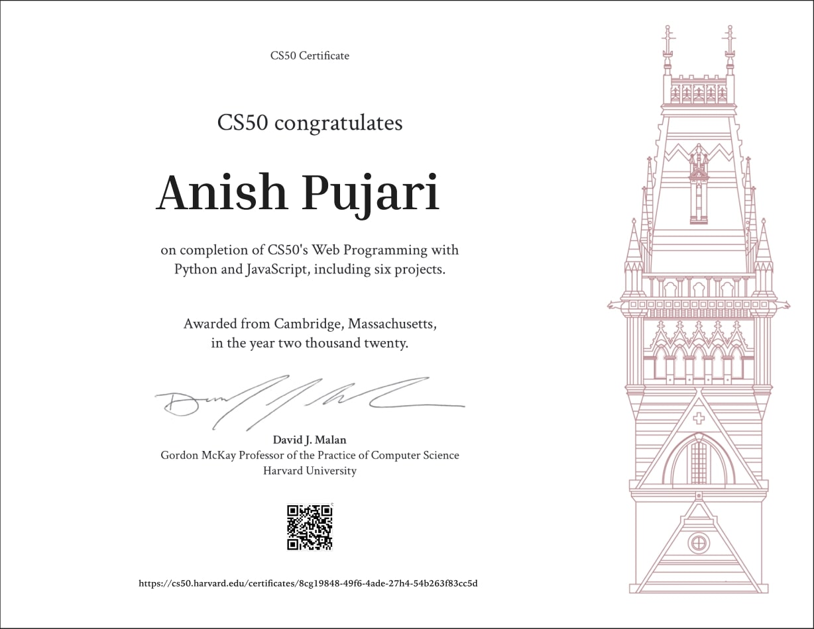

# My Work For all The Certification I have Done

## Under25

 
This certificate is achieved after completing 3 months of internship at Under 25 Summit   

## Google Developer Fest '22

This certificate was awarded after sucessfully completing the Dev fest and hackathon conducted by GDG 

## Getting Started with Enterprise Data Science

This certificate was awarded after learning experience, including hands-on experience, concepts, methods, and tools related to Data Science roles and their use of technology applied to enterprise projects.  

## Mastering AI Tools 

This certificate is awarded after attending a POWER AI tools workshop to increase productivity and efficiency using AI tools

## Python (Basic) Certificate 

This certificate is awarded after completing set of questions under 90 mins for python

## Problem Solving (Intermediate) Certificate 

This certificate is awarded after completing set of questions under 90 mins for Poblem solving which consists concepts of DSA 

## Mastering AI Tools with MS OFFICE

This certificate is awarded after attending a POWER AI tools workshop to increase productivity and efficiency using AI tools in MS OFFICE and automating the process in excel

## CS50's Web Programming with Python and JavaScript

This certificate is awarded after finishing the  CS50's Web Programming with Python and JavaScript.

